## Weken

Week 8

### Woensdag 1 april
Vandaag concept uitgewerkt en verfijnd. Begonnen met de sudoku API in de code zetten met behulp van Jad. Mijn concept: de gebruiker geeft bij de eerste keer openen aan of ze ochtendmens of avondmens zijn, daarna verschijnt er een sudoku op basis van het huidige tijdstip. Wanneer de sudoku correct is opgelost krijgen ze een dad joke te zien.

Ik had eerst het idee om gewoon een sudoku te maken, maar dat was niet uitgebreid genoeg. Daarna heb ik nagedacht over wat ik interessant zou vinden: een sudoku op basis van je Strava activiteit, het weer of je locatie. Die voelden allemaal niet passend of te complex. Uiteindelijk heb ik voor tijd gekozen omdat ik zelf merk dat ik 's ochtends meer energie heb en een moeilijkere sudoku wil dan 's avonds. Dat maakt het concept persoonlijker en iets wat ik echt zelf zou gebruiken en in mijn leven mis.

### Donderdag 2 april
Voortgangsgesprek. Hier kwam uit:
- Voor de tijd te bepalen hoef ik geen API te gebruiken
- De Drag & Drop API is moeilijk maar die volstaat aan een Web API, dan hoef ik niet per se een andere Web API
- Ik kan de localStorage API gebruiken voor het opslaan van sessies en andere dingen

## Weekverslag
Deze week was vooral nadenken en kiezen. De keuze voor sudoku op basis van tijdstip voelt goed omdat het een echte toevoeging is aan een gewone sudoku: de moeilijkheidsgraad past zich aan op de persoon. Ik had andere opties overwogen maar die voelden minder persoonlijk of te moeilijk om te realiseren in de tijd die ik had.

De feedback uit het voortgangsgesprek hielp om het concreter te maken: ik hoef niet alles via externe API's te regelen en localStorage is een prima manier om dingen bij te houden zonder database.

Week 9

### Woensdag 8 april
Ik voelde me vandaag niet lekker dus ben niet naar de les geweest. Ik kon thuis helaas niet genoeg focussen om aan dit project te werken.

### Donderdag 9 april
Vandaag de dag begonnen met een workshop over LocalStorage van Jad. Daarna de gehele dag gewerkt aan het sudoku grid online krijgen en een begin gemaakt aan de styling. Op dit moment zijn de sudoku vakjes nog gewone divs, je kunt er dus nog niks in typen. Dat is iets waar ik volgende week aan ga zitten.

### Vrijdag 10 april
Voortgangsgesprek. Hier kwam uit:
- Volgende week grote inhaalslag maken
- Voor drag & drop naar Senna toe want hij heeft het werkend gekregen
- Detailpagina toevoegen
- Moet grote stappen gaan maken
- Sudoku vakjes zijn nu divs en moeten inputvelden worden

## Weekverslag
Een intense week door ziekte en een begrafenis. Ik heb wel het grid werkend gekregen, maar het is nog niet interactief. De feedback was duidelijk: de divs moeten inputvelden worden en er moet een overzichtspagina komen. Dat de vakjes divs zijn in plaats van inputs was een fout die ik te laat door had, je kunt er nu nog niks in typen.

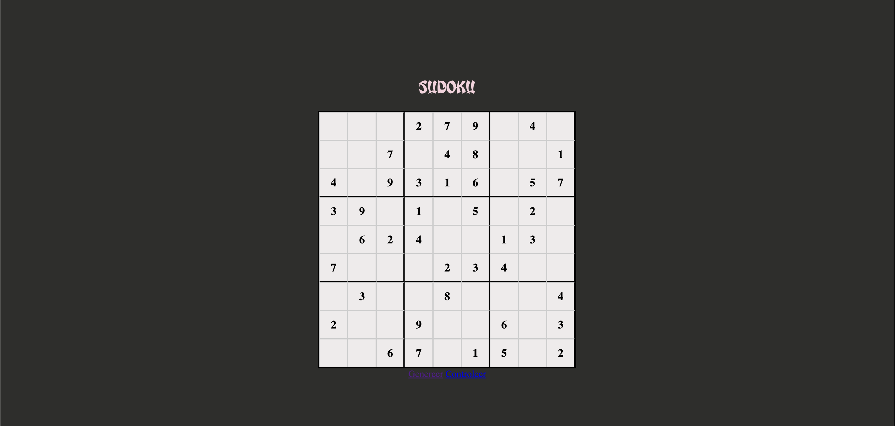

Week 10

### Woensdag 15 april
De sudoku vakjes omgezet van divs naar echte inputvelden. Dit kostte best wat tijd omdat de styling dan ook anders werkt. Ik moest de standaard spinner van een number input verbergen en ervoor zorgen dat je maar één cijfer kunt invullen via een regex.

Ook een popup gemaakt voor het startscherm. Eerst had ik twee knoppen: ochtendmens en avondmens. Maar ik vond dat niet iedereen zo'n voorkeur heeft, dus heb ik 'no preference' toegevoegd als klein linkje eronder. Dat voelt minder zwaar dan een derde grote knop en is ook visueel rustiger.

### Donderdag 16 april
Begonnen met de overzichtspagina en de check-knop. De check-knop was het eerste ding wat ik echt zelf kon: loop door alle cellen, vergelijk de waarde met het juiste antwoord en kleur ze groen of rood.

Voor de overzichtspagina moest ik nadenken over hoe ik sessies opsla. Ik sla elk spel op als een object met een startTime, datum, moeilijkheidsgraad, of het opgelost is en de joke. De startTime gebruik ik om de juiste sessie later terug te vinden.

### Vrijdag 17 april
De koppeling tussen de check-knop en de dad joke API werkend gemaakt. Wanneer alle cellen correct zijn ingevuld wordt de joke opgehaald en opgeslagen in de sessie. Zo zie je op de overzichtspagina later nog welke joke je had verdiend.

Een probleem dat ik tegenkwam: elke keer dat je de pagina refresht werd er een nieuwe sessie aangemaakt. Dat heb ik opgelost door sessionStorage te gebruiken naast localStorage. Als de sessie al gestart is zet ik een vlaggetje in sessionStorage, en dat verdwijnt pas als je de tab sluit of op 'play again' klikt.

## Weekverslag
Dit was de meest productieve week. De app heeft nu een flow: voorkeur kiezen -> sudoku spelen -> oplossen -> joke krijgen -> overzicht zien. De keuze om sessionStorage te gebruiken naast localStorage was een iteratie die ik zelf moest bedenken toen ik merkte dat refreshen problemen gaf. De overzichtspagina heeft nog weinig styling maar de data staat goed.

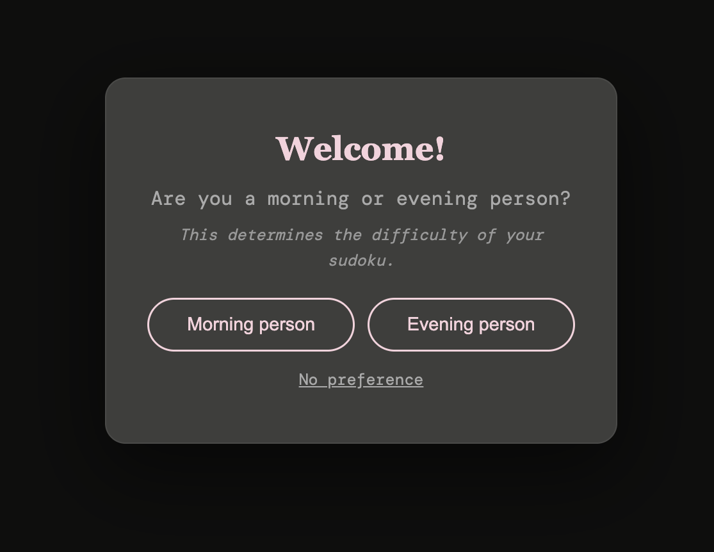
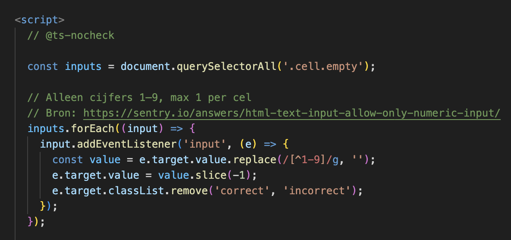
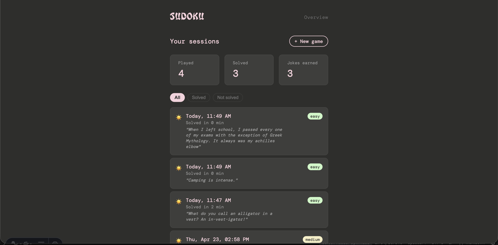
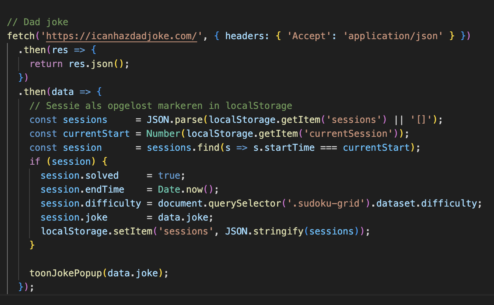

Week 11

### Woensdag 22 april
Kleine verbeteringen op het startscherm doorgevoerd: meer ruimte tussen de tekst en de knoppen, de 'no preference' link wat meer lucht gegeven. Website live gezet via Render. Daarna begonnen met de Drag & Drop.

### Donderdag 23 april
Drag & Drop uitgewerkt. Ik ben eerst in een losse CodePen begonnen om de events te begrijpen zonder dat mijn eigen code in de weg zit. Zodra het daar werkte heb ik het overgezet. Er zijn vijf events die je moet koppelen: `dragstart`, `dragend`, `dragover`, `dragenter`, `dragleave` en `drop`. Elk doet iets anders en de volgorde is belangrijk. Je kunt nu de getallen 1–9 vanuit de balk eronder naar een cel slepen. Tijdens het slepen wordt de cel roze en het getal half transparant.

### Vrijdag 24 april
In de ochtend de drag & drop afgerond en getest. In de middag voortgangsgesprek. Hier kwam uit:
- Alles staat erin voor een oke beoordeling, voor een hoger cijfer moet ik meer ui & ux doen
- Kijken naar fonts & styling
- Dad joke met een popup in beeld laten komen, daarna verder naar het overzicht

## Weekverslag
De drag & drop werkt en ik ben er blij mee! Vond het tegelijkertijd een van de moeilijke dingen in het project maar ook meer te doen dan ik dacht. De keuze om het eerst in CodePen te bouwen was goed advies van Cyd. 

De feedback over UI was duidelijk. De app werkt, maar ziet er nog niet uit als iets wat je zou willen gebruiken. Het grote punt voor de vakantie: beter maken wat er al is en meer features bij extra tijd. 

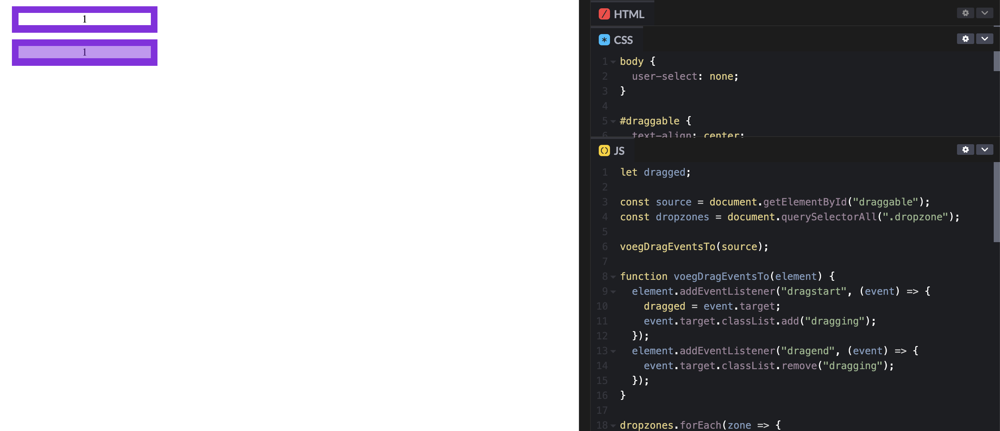
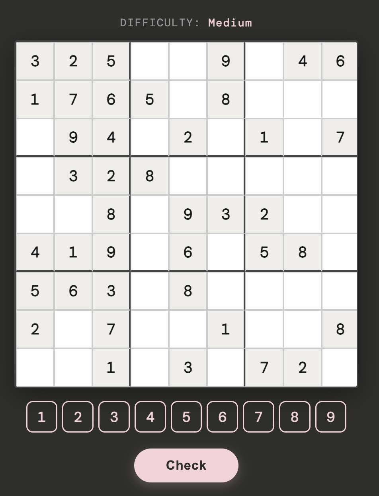

Week 12 — Meivakantie

### Maandag 28 april t/m vrijdag 2 mei
In de vakantie gefocust op UI en afwerking. De functionaliteit stond er al, maar het zag er nog niet goed genoeg uit.

**Dad joke popup**
De popup was eerst heel basic: gewoon tekst op de pagina. Ik heb hem omgebouwd naar een overlay met een donkere achtergrond, roze border en een slide-in animatie. Ook heb ik de joke gesplitst in een vraag en een antwoord. Veel dad jokes hebben een vraag-antwoord formaat en dat leest veel leuker dan één lange zin. De splitsing gebeurt op de `?` in de tekst, met een fallback als er geen vraagteken is.

**Confetti**
Confetti leek me een leuke toevoeging als beloning voor het oplossen. Ik had het nog nooit eerder gebruikt en heb via Claude uitgezocht hoe ik de library kon inladen. Het zijn drie golven geworden in het roze kleurenpalet van de app, zodat het bij de rest van de stijl past.

**Overzichtspagina**
De overzichtspagina had al de data maar zag er nog niet uit. Ik heb statistieken bovenaan toegevoegd (hoeveel gespeeld, hoeveel opgelost, hoeveel jokes verdiend) en filterknoppen zodat je alleen opgeloste of niet-opgeloste sessies kunt zien. Elke sessie toont de datum, een zon of maan op basis van het tijdstip, de moeilijkheidsgraad als badge en de joke als die er is. De keuze voor een zon of maan vond ik een leuke toevoeging: het past bij het idee van ochtend vs avond.

**Code opschonen**
Alle CSS omgezet van rem naar em, eenregelige CSS uitgeschreven naar meerdere regels en de volgorde van properties consistent gemaakt. Annotaties erbij gezet en bronnen toegevoegd.

## Weekverslag
Mijn vakantie was best productief. Het grootste verschil zit in hoe de app aanvoelt: de popup en de overzichtspagina zien er nu echt goed uit. De keuzes die ik in de vakantie heb gemaakt zijn bijna allemaal UI-keuzes: hoe toon ik de joke, wat doe je na het oplossen, hoe maak ik de overzichtspagina leesbaar. Dat zijn iteraties op bestaande functionaliteit, geen nieuwe features.

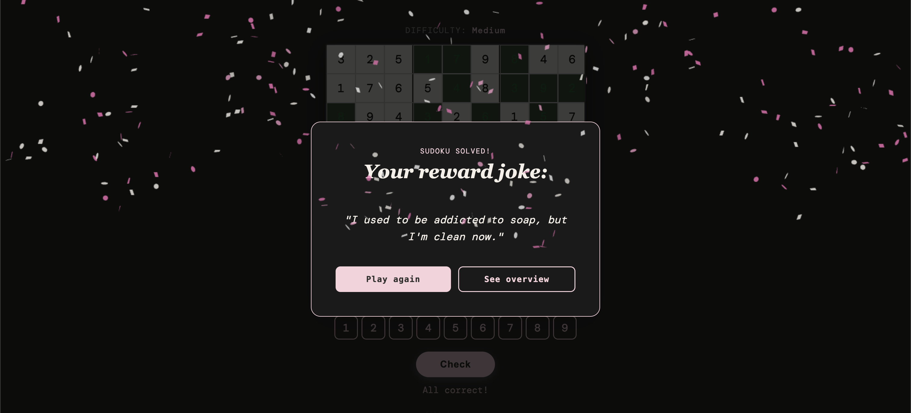

Week 13

### Woensdag 6 mei
Laatste kleine aanpassingen gedaan. Bronnen netjes in de README gezet, per onderwerp met de juiste links en Claude-prompts waar van toepassing. De 'Play' knop uit de navigatie gehaald omdat het logo/ de tekst sudoku al naar de homepagina linkt. Ik heb het procesverslag en de readme bijgewerkt en daarna gewerkt aan de eindoplevering. Code nog een keer doorgelopen om te controleren of alle annotaties kloppen en alle bronnen er goed bij staan.

## Weekverslag
De laatste week was afronden. Ik heb bewust geen nieuwe dingen meer toegevoegd maar alles wat er al was netter gemaakt, voor nieuwe dingen toevoegen was er niet veel tijd. De bronnen en het procesverslag kosten meer tijd dan ik dacht, maar het is nuttig om terug te lezen waarom ik bepaalde keuzes heb gemaakt. 

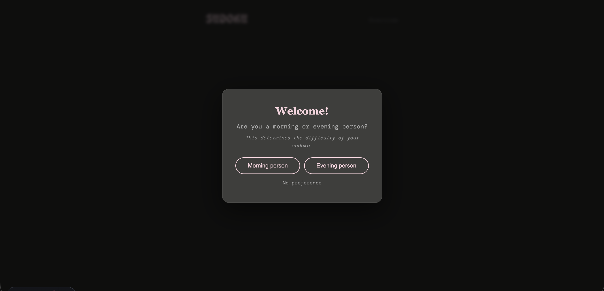
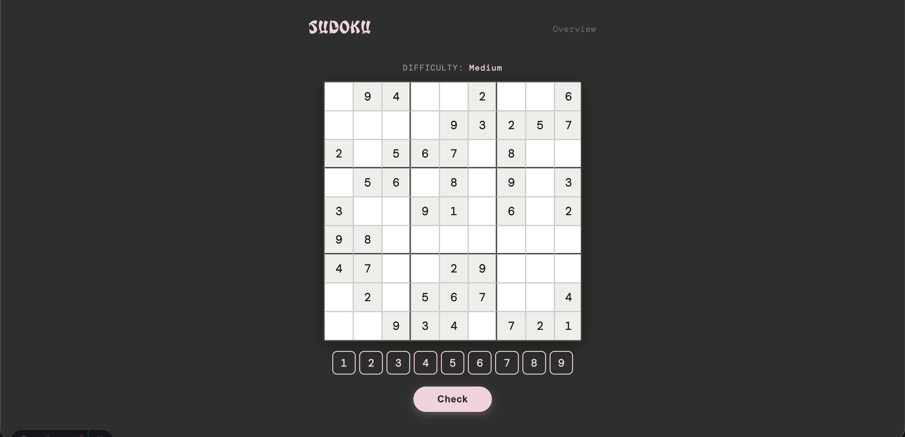
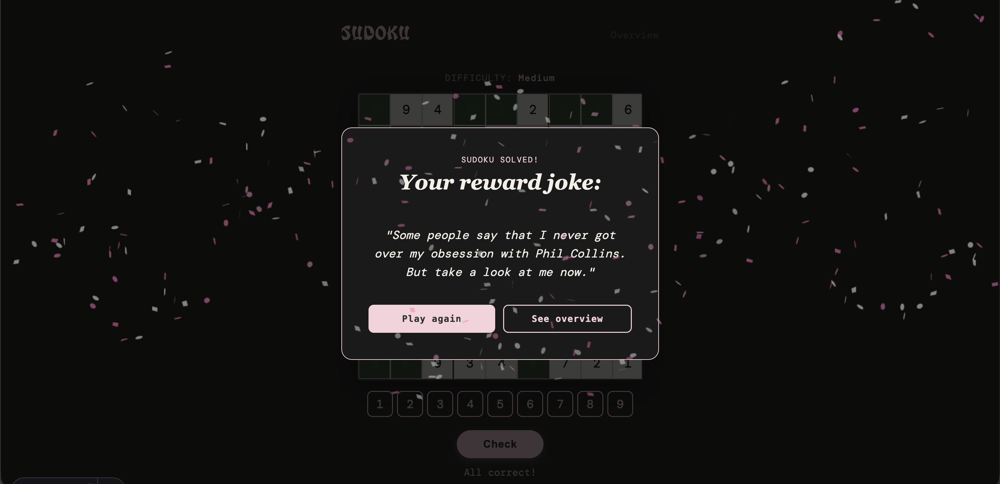
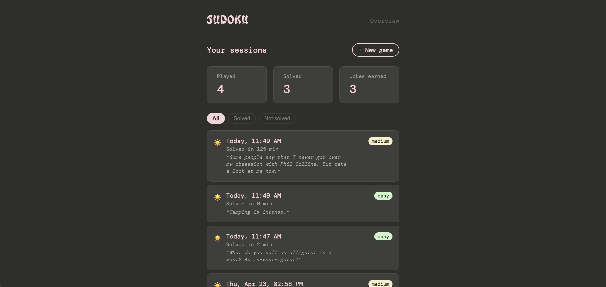

Bronnen

Tijd uitlezen via JavaScript
- https://developer.mozilla.org/en-US/docs/Web/JavaScript/Reference/Global_Objects/Date

Invoer beperken tot cijfers 1–9 met regex
- https://sentry.io/answers/html-text-input-allow-only-numeric-input/

Cel selectie bij focus en blur
- Geen externe bron, eigen logica

Drag & Drop API
- https://developer.mozilla.org/en-US/docs/Web/API/HTML_Drag_and_Drop_API
- https://dev.to/anuraggharat/html-drag-and-drop-api-5gd3

Sessie opzoeken met Array.find
- https://developer.mozilla.org/en-US/docs/Web/JavaScript/Reference/Global_Objects/Array/find

Dad joke API
- https://icanhazdadjoke.com/

Joke splitsen in vraag en antwoord
- Claude. Prompt: hoe kan ik een dad joke splitsen in een vraag en antwoord als de scheiding een ? is

Confetti inladen
- Claude. Prompt: hoe zou ik confetti kunnen inladen die verschijnt wanneer de gebruiker iets triggered
- https://cdn.jsdelivr.net/npm/canvas-confetti@1.9.2/dist/confetti.browser.min.js

Play again met sessionStorage
- https://dev.to/jmjkim/how-to-keep-input-values-even-after-reloading-your-browser-4mm5

Dikke lijnen op elke 3e rij en kolom met nth-child
- https://codepen.io/sdobson/pen/aEWBQw
- Claude. Prompt: hoe target ik met nth-child de rijen 3 en 6 in een sudoku grid

Puzzeldata plat maken met flat()
- Claude. Prompt: ik krijg x data uit mijn API maar ik krijg de getallen niet in deze x grid. Hoe kan ik dat wel doen?

API-sleutel instellen
- Jad heeft me hierbij geholpen

Sessies lezen en opslaan met localStorage
- https://developer.mozilla.org/en-US/docs/Web/API/Window/localStorage

Sessies omgekeerd sorteren met Array.reverse
- https://developer.mozilla.org/en-US/docs/Web/JavaScript/Reference/Global_Objects/Array/reverse

Datum formatteren
- https://developer.mozilla.org/en-US/docs/Web/JavaScript/Reference/Global_Objects/Date/toLocaleDateString

Lijst items aanmaken met Document.createElement
- https://developer.mozilla.org/en-US/docs/Web/API/Document/createElement

